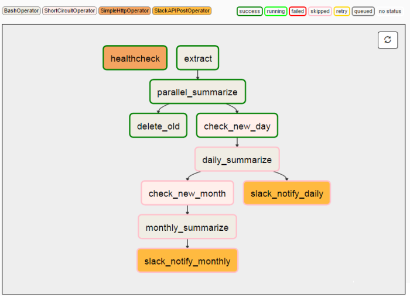
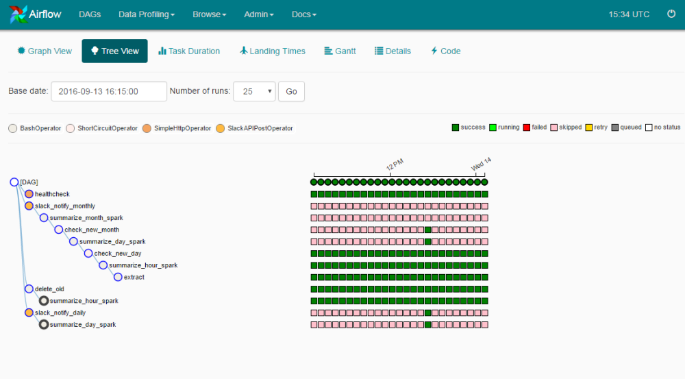
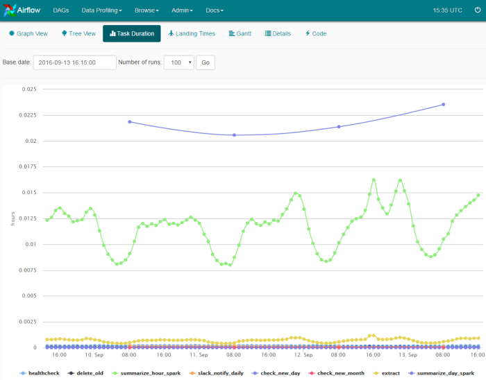

# Traditional ETL approach (cron jobs)

- Monitoring
    - Success or failure status
    - How long does the process runs
    
- Dependencies
    - Between tasks
    - Data dependencies
    - Retry if failure happens (how many times and how often)

- Scalability
    - Hard to debug and maintain
    - It’s very difficult to add new jobs in complex crons
    - Rich logging have to be handled externally

---

# Automation tools

- Ansible
- Chef
- Luigi
- Jenkins
- Apache Airflow

---

# Jenkins

[https://jenkins.beedataanalytics.com/](https://jenkins.beedataanalytics.com/)

---

# Jenkinsfile (Declarative Pipeline)

- Text file that contains the definition of a Jenkins Pipeline
- Is checked into source control

[Esfera luz configuration pipeline](https://github.com/xdurana/pipeline-esfera/blob/master/Jenkinsfile)

---

# Apache Airflow

- Workflows defined as directed acyclic graphs (DAGs) in Python
- Dynamic pipeline generation
- Cool web interface to monitor the DAGs
- Integration with Celery
- Multiple operators like bash, http, slack, etc.
- Integrates with Apache Superset

---

# Apache Airflow

---

# Apache Airflow

---

# Apache Airflow

